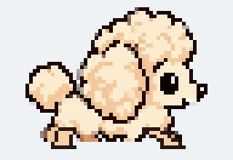
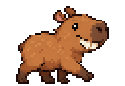

# Pixel Hedgies

| Hedgehog | Poodle | Capybara |
| --- | --- | --- |
|  |  |  |

A tiny Windows desktop pet. Hedgehogs render at 64 × 44 pixels, with
crisp retro pixel scaling. They walk on the top edges of ordinary windows,
including the Windows 11 taskbar, fall when they wander off, and land on another
window or the monitor's bottom edge. When two meet, one scrambles onto the
other's back, rides briefly, then hops away.

## Controls

- Left-click an animal: add another with the same selected skin.
- New animals appear at a random position along the top of that monitor and fall in.
- Drag an animal: relocate it.
- Right-click an animal: choose **Hedgehog**, any PNG skin found in the `Images` folder,
  or **Random**; remove that animal or remove every animal and exit. Animals set to **Random** choose a fresh random skin
  when duplicated.
- The notification-area menu offers **Add animal** and **Remove all animals and exit**.

## Build and run

The ready-to-run Windows release is in `releases/win-x64-v14/`.
Double-click `PixelHedgies.exe` there. Keep the accompanying DLLs in the same
folder; this build does not require a separate .NET installation. The EXE is
stored with Git LFS because it exceeds GitHub's regular file-size limit. Install
Git LFS before cloning, or run `git lfs pull` after cloning to download it.
Exit any older Pixel Hedgies instance from its notification-area icon before
starting this one.

## Custom skins

Place PNG files in the `Images` folder beside `PixelHedgies.exe`. The name before
`.png` (or before `-frame-0.png`) becomes the character name in the right-click
**Change animal skin** menu; for example, `Capybara-frame-0.png` adds
**Capybara**. The menu rescans the folder each
time it opens, so a newly added character does not require an app restart.
Custom skins are also included in **Random**.

- Format: PNG with transparency (RGBA). Use a 64 × 44 pixel canvas for sharp
  1:1 display; other sizes load but are scaled into that area. Leave the area
  outside the animal transparent, with its feet near the bottom edge.
- Direction: draw the head and face pointing **right**. The app mirrors the
  image automatically when the animal walks left.
- Required frames: **one**. Name it `Name.png` or `Name-frame-0.png`.
  `Name-frame-0.png` takes precedence if both exist. A single image is reused
  for every missing pose.
- Optional frames: up to **five** more, named `Name-frame-1.png` through
  `Name-frame-5.png`. Frame 0 and 1 alternate while walking; frame 2 is blink,
  frame 3 looks toward the viewer, frame 4 rolls, and frame 5 is idle. The app
  also rotates frame 4 during a roll. Frames 1–5 alone do not create a skin.
  Use the same 64 × 44 canvas and align the body between frames.

To build from source, install the .NET 10 SDK on Windows, then run:

```powershell
dotnet run --project PixelHedgies/PixelHedgies.csproj
```

The window-overlap geometry checks can be run with:

```powershell
dotnet run --project PixelHedgies.GeometryChecks/PixelHedgies.GeometryChecks.csproj
```

To publish a self-contained Windows build:

```powershell
dotnet publish PixelHedgies/PixelHedgies.csproj -c Release -r win-x64 --self-contained true -p:PublishSingleFile=true
```

The current action sheet lives at `PixelHedgies/Assets/hedgehog-actions-v4.png`, and the two-frame walk strip at `PixelHedgies/Assets/hedgehog-walk-retro-v2.png`. The belly is never clipped; a dark far-side front paw is drawn behind the sprite to keep both front feet visible at 64 × 44 pixels.
The original sprite remains at `PixelHedgies/Assets/hedgehog.png`. The app intentionally
does not install itself at startup or require administrator privileges. The
hedgehogs are always on top of ordinary windows; fullscreen games and some
protected/system windows are outside the scope of this version.
